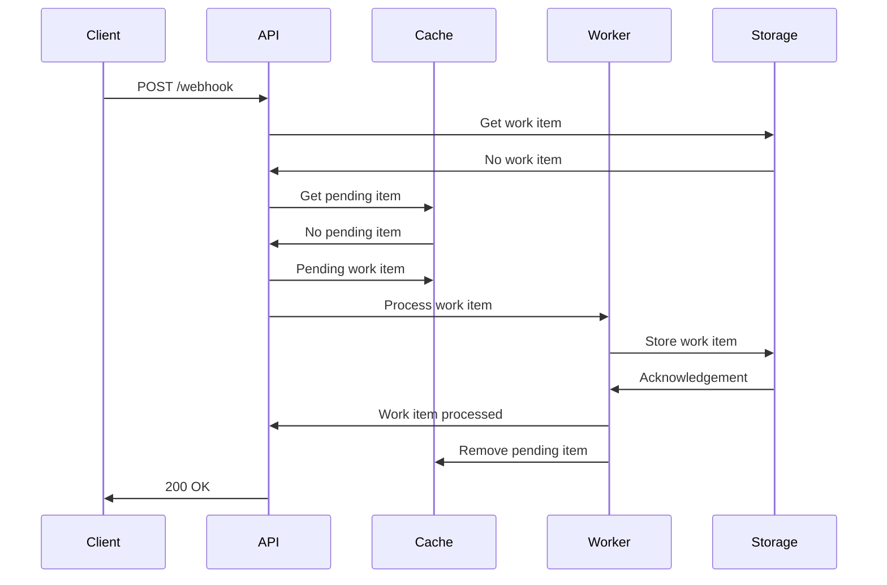
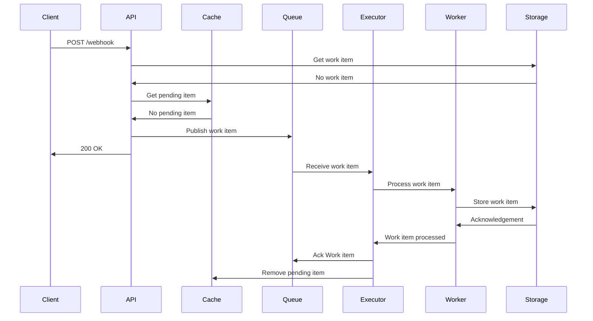

Sure, here's a concise software design document for the webhook handling system:

# Webhook Handling System Design

## Overview

The Webhook Handling System is a fault-tolerant, scalable solution for processing webhooks from third-party services. It
is designed to ensure data integrity, reliability, and service scalability, even when handling webhooks at an
uncontrollable rate without the ability to retry once acknowledged.

## Architecture

The system consists of the following components:

1. **Webhook Handler**: This is the entry point of the system, responsible for receiving and processing incoming webhook
   requests. It handles the requests synchronously, simulating work by adding a 1-second delay and storing the work item
   in the database.

2. **Webhook Processor**: This component is responsible for asynchronously processing the work items from the queue. It
   uses an executor pattern to distribute the work items among multiple workers, ensuring scalability.

3. **Cache**: The system uses a Redis cache to store the pending work items. This adds a layer of prevention against
   race conditions.

3. **Storage**: The system uses a SQLite database to store the processed work items. The storage layer ensures data
   integrity by handling duplicate work items.

4. **Message Queue**: RabbitMQ is used as the message queue to decouple the synchronous webhook handling from the
   asynchronous processing. This allows the system to scale independently and handle high volumes of webhooks without
   affecting the response time.

5. **Executor**: The executor pattern is used to manage the worker threads that process the work items from the message
   queue. This ensures efficient utilization of system resources and prevents overloading the system.

## Data Flow

Synchronous Data Flow

Asynchronous Data Flow

